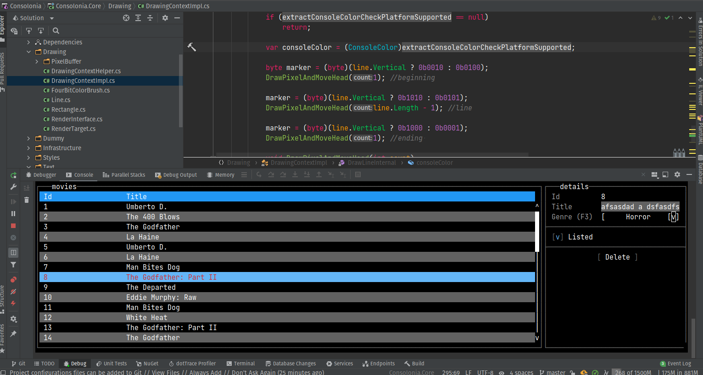
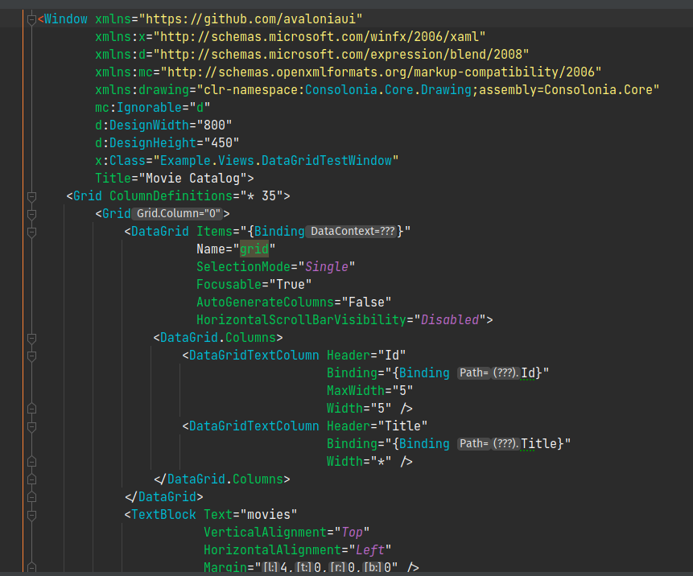

# Consolonia UI

TUI (Text User Interface) (GUI Framework) implementation for [Avalonia UI](https://github.com/AvaloniaUI)

> Project is in proof of concept state and is looking for collaboration.

## Showcase run inside Rider Debug Console

## In action

Code used: 

Solution contains one more readme file with coding information.
