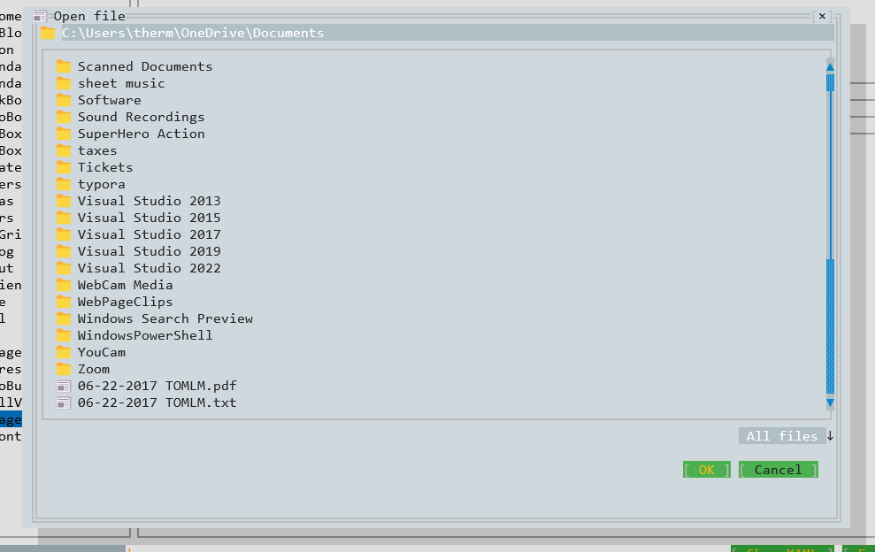

# Dialogs
Console apps don't have model dialogs, so Consolonia implements them as a custom control.

## Define a Dialog
To define a dialog you create a element which derives from **DialogWindow**

```xaml
<controls:DialogWindow xmlns="https://github.com/avaloniaui"
                       xmlns:x="http://schemas.microsoft.com/winfx/2006/xaml"
                       xmlns:controls="clr-namespace:Consolonia.Core.Controls;assembly=Consolonia.Core"
                       HorizontalAlignment="Center"
                       VerticalAlignment="Center"
                       x:Class="Consolonia.Gallery.Gallery.GalleryViews.SomeDialogWindow">
    <Panel>
        <TextBlock Text="Hello World" />    
        <Button Content="DoSomething"
                Name="DoSomethingButton"
                HorizontalAlignment="Right"
                VerticalAlignment="Bottom"
                Click="DoSomethingButton_Clicked" />
    </Panel>
</controls:DialogWindow>
```


## Show a Dialog
To show a dialog you create an instance of the dialog and call the ShowDialog method.
```csharp
var dialog = new SomeDialogWindow();
var result = async dialog.ShowDialogAsync<MyResult>();
```

## Close a Dialog
To close a dialog you call the Close method, optionally passing a result.
```csharp
Close(new MyResult());
```

## Dialog Result
The result of the dialog is returned from the ShowDialogAsync method. The result will be of type ResultT and will be the result of the object returned when the .Close() method is called.

# MessageBox
Consolonia implements a DialogWindow called MessageBox class which makes it simple to show simple message boxes and get input from the user.

## Show a MessageBox
To show a message box you instantiate a MessageBox object and call the ShowDialogAsync method. The kind of buttons shown will depend on the mode that is passed in.

```csharp
var mb = new MessageBox
{
    Mode = Mode.YesNoCancel,
    Title = "Yes/No/Cancel Message box"
};
var result = await MessageBox.ShowDialogAsync("Hello World");
```

|DialogMode | Description |
|-----------|-------------|
| **Ok**    | Shows an OK button |
| **OkCancel**    | Shows an OK and Cancel button |
| **YesNo** | Shows a Yes and No button |
| **YesNoCancel**  | Shows a Yes, No and Cancel button |

The result of the message box is of type MessageBoxResult and will be the result of the button clicked.

|DialogBoxResult | Description |
|-----------|-------------|
| **Ok**    | OK button was clicked |
| **Cancel**    | Cancel button was clicked |
| **Yes** | Yes button was clicked |
| **No**  | No button was clicked |


# IStorage in Consolonia
The Avalonia `IStorage` interface provides a way to interact with various storage mechanisms. In Consolonia it implements them using a DialogWindow providing character based way of letting the user interact with the file system.



## Getting access to the IStorage interface
The storage interface is defined on the application lifetime, which is available via `Application.Current.ApplicationLifetime`

```csharp
if (Application.Current.ApplicationLifetime is IClassicDesktopStyleApplicationLifetime lifetime)
{
    IStorageProvider storageProvider = lifetime.MainWindow.StorageProvider;
    if (storageProvider.CanOpen)
    {
        var files = await storageProvider.OpenFilePickerAsync(new FilePickerOpenOptions
        {
            Title = title,
            AllowMultiple = allowMultiple,
            SuggestedStartLocation = new SystemStorageFolder(new DirectoryInfo(Environment.GetFolderPath(Environment.SpecialFolder.MyDocuments))),
            FileTypeFilter = new List<FilePickerFileType>
            {
                new("All files") { Patterns = ["*"] },
                new("Text") { Patterns = ["*.txt"] },
                new("Comma Delimited Files") { Patterns = ["*.csv"] },
                new("PDF") { Patterns = ["*.pdf"] }
            }
        });
        // files is the selected files.
        ...
```

> See (Avalonia Storage Options)[https://docs.avaloniaui.net/docs/concepts/services/storage-provider/storage-item] for more details on the options available.

# References 
* [Overview](/docs)
* [Quick Start](/docs/QuickStart.md)
* [Application](/docs/Application.md)
* [Dialogs](/docs/Dialogs.md)
* [Blazor](/docs/Blazor.md)

