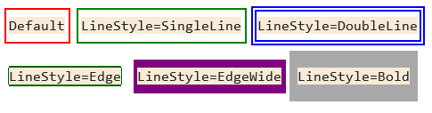

# Overview
Consolonia leverages the grid-based layout system of the console, where each character represents a pixel. By using various characters, you can draw lines, boxes, and shapes to create complex layouts and designs. 

All Avalonia concepts are supported:
* DataBinding/Converters/View models
* Text Controls (TextBlock, TextBox, Run, etc)
* Layout controls (Grid, DockPanel, etc)
* Input Controls (Button, TextBox, Calendar, etc.)
* Animations
* Resources/Styles/Theming
* Code-Behind 
* Event bubbling/Commands
* etc,

# Platform Characteristics
While Consolonia apps are just Avalonia apps, the application semantics need to snap to the characteristics of a console application.

## Pixel = Character 
The most import thing to know is that Consolonia **maps pixels to characters**. Each pixel is a single character. This means that when you are defining the layout of your application views you are doing it at the granularity of units of characters. 

## Layout
Avalonia lays out controls using units expressed in pixels. Since on Consolonia pixels are 1:1 with characters, layout is expressed as character sized units.  For example, a 10x10 grid is 10 characters wide by 10 characters tall.  A padding of 1 is a single character wide padding, etc.

While this may seem a bit strange coming from a GUI, it is actually quite natural for a console application since you already think of the application as arrangments of characters. 

## Colors
Just like any avalonia app you can use Foreground/Background to define the color of the elements of your UI. Consolonia uses the colors just like any avalonia application. The only important thing to realize is that again, the colors apply to the pixels and pixels are character sized. This means that every character in the console has 3 charactersitcs:
* a Foreground color
* a Background color
* a character to display (with whatever font characteristics you set)

## Text
Consoles utilize a fixed monospace font which you don't control, so FontFamily and FontSize do not apply but all other font characteristics, such as TextDecorations, FontWeight, FontStyle, as well as foreground and background colors work as normal.

```xaml
<TextBlock Text="Hello World" 
    Background="Black"
    Foreground="Yellow" 
    FontWeight="Bold"
    TextDecorations="Underline" 
    FontStyle="Italic"/>
```


### Icons
Since Consolonia uses unicode characters you can utilize the full range of unicode characters, including emojis to create a richer looking user interface that you would normally use bitmaped assets for. For example, to draw rectangles Consolonia uses the unicode box drawing characters.

## Drawing Lines
You can draw horizontal or vertical lines, not arbitrary angled lines. Consolonia uses the unicode box drawing characters to draw lines. Transforms are legitimate as long as the resulting line is horizontal or vertical.
```xaml
<Line StartPoint="1,0"
      EndPoint="10,0"
      Stroke="Yellow"
      StrokeThickness="1" />
```

## Drawing Rectangles
Likewise you can draw rectangles using the Rectangle element.

```xaml
<Rectangle Width="10" Height="10" Fill="Yellow" Stroke="Red" StrokeThickness="1"/>
```

## Drawing Borders
You can draw borders around elements by using the Border element. 
```xaml
<Border BorderBrush="Yellow" BorderThickness="1">
    <TextBlock Text="Hello World" />
</Border>
```

> The default border will use a LineBrush to draw the border as a single line box char in the foreground color. See LineBrush for more details


### LineBrush
Consolonia draws lines via unicode box drawing characters. The default LineBrush uses single wide, but you can control the way it draws the lines by by defining LineBrush.  The LineBrush allows you to control the characters that are used to draw the line/border. 



| LineStyle | Description |
|-----------|-------------|
| **SingleLine** *(default)*    | Single line box characters which can overlap |
| **DoubleLine**    | Double line box characters which can overlap |
| **Edge** | 1/8 width border characters tight on border edge|
| **EdgeWide**  | 1/4 width border characters tight on border edge |
| **Bold** | full size border characters tight on border edge |

```xaml
<Border BorderThickness="1">
    <Border.BorderBrush>
        <drawing:LineBrush LineStyle="Edge" Brush="Purple" />
    </Border.BorderBrush>
    <TextBlock Text="Hello world" />
</Border>
```

## Drawing Bitmaps
Consolonia implements the ability to draw bitmaps by mapping to quad pixel characters.  It works, but the resolution is by definition limited due to the limiations of the console itself.
```xaml
<Image Source="avares://Consolonia/Assets/avalonia.png" />
```


# References 
* [Quick Start](/docs/QuickStart.md)
* [Application](/docs/Application.md)
* [Dialogs](/docs/Dialogs.md)
* [Blazor](/docs/Blazor.md)

